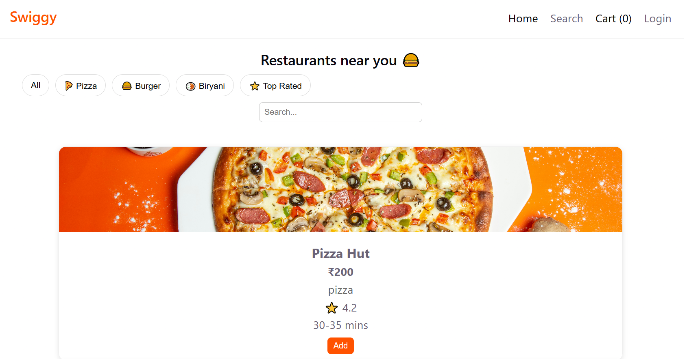

# Swiggy-Clone-React-Tailwind | Completed 
Responsive food delivery UI built with React + Tailwind, focusing on reusable components and modern layout system 

A responsive food delivery web application inspired by Swiggy, built using React and Tailwind CSS.  
This project focuses on building a real-world frontend system using component-based architecture.

---

## Tech Stack
- React.js
- Tailwind CSS
- JavaScript (ES6+)
- React Router

---

## Features
- Responsive restaurant listing UI
- Dynamic menu pages layout
- Component-based reusable architecture
- Navigation between pages using React Router
- Mobile-friendly responsive design
- Clean and modern UI inspired by Swiggy

---

## Screenshots

### Home Page

---

## Purpose / Learning Outcome
- Strengthened React fundamentals and component-based architecture
- Learned routing using React Router
- Improved state management and UI structuring
- Practiced building scalable frontend applications
- Gained experience in real-world product UI design

---

## Status
Completed 
---

## 🔗 Live Demo
[https://vercel.com/prajakta-deokars-projects/swiggy-clone-react-tailwind](https://swiggy-clone-react-tailwind.vercel.app/)

---

## 💡 Note
This project is a frontend-only clone focused on UI and user experience. No backend integration is included yet.
